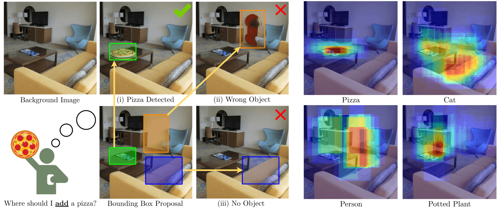
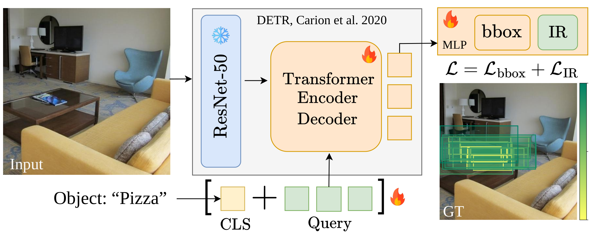
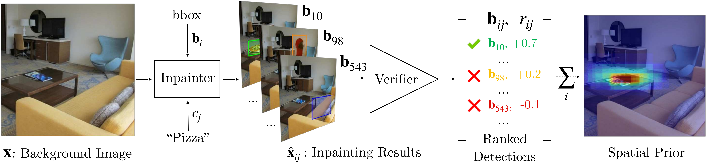

# HiddenObjects: Scalable Diffusion-Distilled Spatial Priors for Object Placement

<p align="center">
  <a href="https://marcoschouten.github.io/">Marco Schouten</a><sup>1, 3</sup>&emsp; 
  <a href="https://ysig.github.io/">Ioannis Siglidis</a><sup>2, 3</sup>&emsp; 
  <a href="https://serge.belongie.com/">Serge Belongie</a><sup>2, 3</sup>&emsp; 
  <a href="https://dimipapa.github.io/">Dim P. Papadopoulos</a><sup>1, 3</sup>
</p>

<p align="center">
  <sup>1</sup>Technical University of Denmark&emsp; 
  <sup>2</sup>University of Copenhagen&emsp; 
  <sup>3</sup>Pioneer Centre for AI
</p>

<p align="center">
  
</p>

<p align="center">
  <a href="https://hidden-objects.github.io/"></a>
  <a href="https://huggingface.co/datasets/marco-schouten/hidden-objects"></a>
  <a href="LICENSE"></a>
</p>

> **TL; DR:** We distill spatial priors from large-scale diffusion inpainting into a lightweight detector that predicts *where* a given object can be realistically placed in a scene.

---

## 1. Dataset Visualization

The full dataset annotations (~5 GB) is hosted on [HuggingFace](https://huggingface.co/datasets/marco-schouten/hidden-objects). Background images come from [Places365](http://places2.csail.mit.edu/download.html) (~300GB).

**Data schema:**

| Field | Type | Description |
|:---|:---|:---|
| `entry_id` | `int64` | Unique row identifier |
| `bg_path` | `string` | Relative path to background image in Places365 |
| `fg_class` | `string` | Foreground object category (e.g., `"bottle"` ) |
| `bbox` | `list` | Bounding box `[x, y, w, h]` , normalized 0–1 |
| `label` | `int64` | 1 = positive, 0 = negative |
| `image_reward_score` | `float64` | ImageReward ranker score |
| `confidence` | `float64` | GroundedDINO detection confidence |

Bounding boxes are defined on a **512x512 center crop**: resize shortest side to 512px, then center crop.

**Installation**

```bash
uv venv && source .venv/bin/activate
uv pip install datasets matplotlib Pillow torch torchvision
```

Background images can be downloaded via torchvision:

```python
import torchvision.datasets as datasets
datasets.Places365(root="./data/places365", split="train-standard", small=False, download=True)
```

**Quick Start**

```python
from datasets import load_dataset

dataset = load_dataset("marco-schouten/hidden-objects", streaming=True)
first_row = next(iter(dataset["train"]))
```

**PyTorch Dataloader**

See [`data_loader.py`](dataset_visualization/data_loader.py) for a ready-to-use PyTorch `Dataset` and streaming loader.

```python
from dataset_visualization.data_loader import HiddenObjectsDataset, get_streaming_loader

# Map-style (requires local Places365 images)
ds = HiddenObjectsDataset("./data/places365", split="train")

# Streaming (no full download needed)
loader = get_streaming_loader("./data/places365", batch_size=32)
```

---

## 2. Distilled Model

<p align="center">
  
</p>
We distill the full inpaint-and-verify pipeline into a class-conditioned Transformer Encoder-Decoder that directly predicts placement bounding boxes and plausibility scores from a background image and object label.

Two checkpoints are provided in `distilled_model/checkpoints/`  `placement_detr_ho.pth` Trained on HiddenObjects dataset
`placement_detr_opa.pth` : Trained on OPA dataset (subset supporting 28 object categories).

**Installation**

```bash
cd distilled_model
pip install -r requirements.txt
```

**Example:**

```bash

## inference

python inference.py --checkpoint checkpoints/placement_detr_ho.pth \
                    --image bg.jpg --class-name "bottle" --top-k 5 \
                    --visualize --output viz.png
```

```bash

## train (data auto-downloaded from HuggingFace)

python train.py --places365_dir /path/to/Places365 \
                --filter_b 20 --min_confidence 0.7

## or download data manually first

python download_data.py --output_dir data
python train.py --train_jsonl data/ho_irany_train_28_classes.jsonl \
                --test_jsonl data/ho_irany_test_28_classes.jsonl \
                --places365_dir /path/to/Places365
```

## 3. Data Creation Pipeline

<p align="center">
  
</p>

Given a background image and a target object category, we (1) we inpaint each candidate bounding box with a diffusion model, (2) verify whether the inpainted object is plausible, and (3) aggregate verified detections into a dense spatial prior.

> [! NOTE]
> Code coming soon.

## Evaluation

<p align="center">
  
</p>

Downstream image editing quality evaluated by [ImgEdit-Judge](https://github.com/pku-yuangroup/imgedit)  (1-5). We compare our annotation pipeline against various placement strategies.

| Method | Test Set | PC ↑ | VN ↑ | PDC ↑ | Avg ↑ |
|:---|:---|:---:|:---:|:---:|:---:|
| Raw Background | HiddenObjects | 1.04 | 1.03 | 1.03 | 1.04 |
| Full Mask | HiddenObjects | 1.62 | 1.60 | 1.59 | 1.60 |
| Random BBox | HiddenObjects | 2.73 | 2.62 | 2.62 | 2.65 |
| **Ours (Annotation Pipeline)** | **HiddenObjects** | **3.83** | **3.63** | **3.63** | **3.69** |
| | | | | | |
| Raw Background | OPA | 1.00 | 1.00 | 1.00 | 1.00 |
| Full Mask | OPA | 1.66 | 1.66 | 1.66 | 1.66 |
| Human Annotation | OPA | 2.72 | 2.66 | 2.66 | 2.68 |
| Random BBox | OPA | 2.97 | 2.84 | 2.84 | 2.89 |
| **Ours (Annotation Pipeline)** | **OPA** | **4.05** | **3.83** | **3.83** | **3.90** |

---

## License

This project is released under the [MIT License](LICENSE).

## Citation

```bibtex
@inproceedings{schouten2026hiddenobjects,
  author    = {Schouten, Marco and Siglidis, Ioannis and Belongie, Serge and Papadopoulos, Dim P.},
  title     = {HiddenObjects: Scalable Diffusion-Distilled Spatial Priors for Object Placement},
  booktitle = {preprint arxive},
  year      = {2026}
}
```

## Contact

For questions or feedback, reach out to [marscho@dtu.dk](mailto:marscho@dtu.dk).
